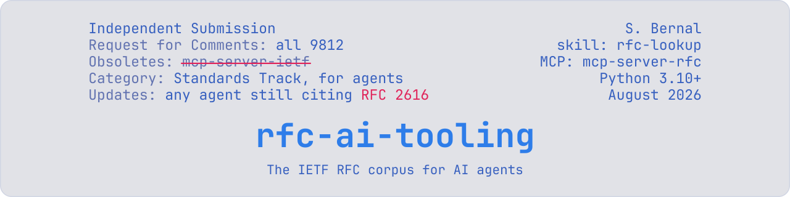
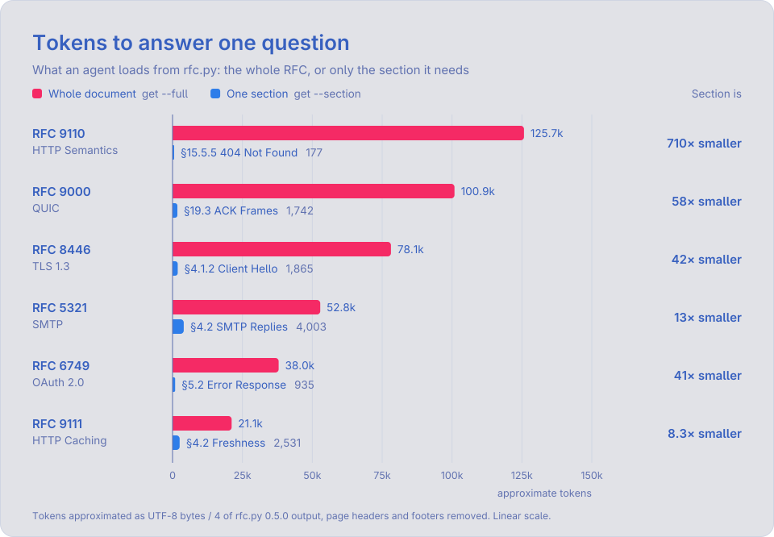
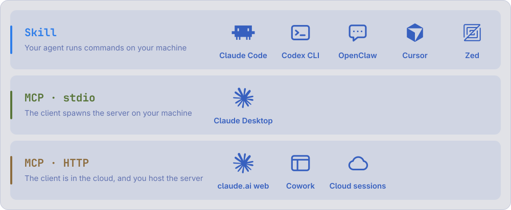
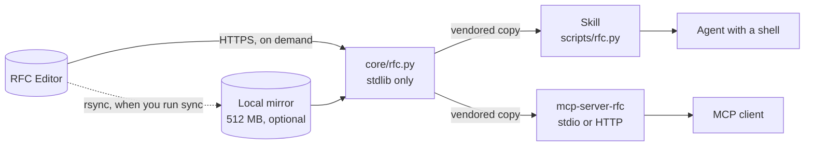

<div align="center">

<picture>
  <source media="(prefers-color-scheme: dark)" srcset="assets/banner/banner-dark.svg">
  
</picture>

**Let AI agents read IETF RFCs one section at a time, with superseded specs flagged.**

[![Tests][ci-badge]][ci]
[![License][license-badge]][license]

---

<a href="#install"><picture><source media="(prefers-color-scheme: dark)" srcset="assets/nav/install-dark.svg"></picture></a>
<a href="#quickstart"><picture><source media="(prefers-color-scheme: dark)" srcset="assets/nav/quickstart-dark.svg"></picture></a>
<a href="#why"><picture><source media="(prefers-color-scheme: dark)" srcset="assets/nav/why-dark.svg"></picture></a>
<a href="#how-it-works"><picture><source media="(prefers-color-scheme: dark)" srcset="assets/nav/how-it-works-dark.svg"></picture></a>
<a href="CHANGELOG.md"><picture><source media="(prefers-color-scheme: dark)" srcset="assets/nav/changelog-dark.svg"></picture></a>

---

</div>

<picture>
  <source media="(prefers-color-scheme: dark)" srcset="assets/demo/agent-session-dark.svg">
  
</picture>

## What it is

Two ways to give an AI agent the IETF RFC corpus: a skill and an MCP server.
Both run the same stdlib-only Python core, so they find, read and flag documents identically.
No RFC text ships with either; documents come from the RFC Editor on demand.

- **Obsolescence on every result.** A superseded RFC says so in a banner the model can't miss: `!! OBSOLETED BY: RFC 7230, 7231, ...`
- **Section reads.** List an RFC's headings with line numbers, then read only the section that answers the question.
- **Search.** By title out of the box, or across the full text of all ~9,800 RFCs once you sync a local mirror.
- **Clean text.** Page headers, footers and form feeds are stripped.
- **A guard on oversized reads.** A read over 1500 lines that isn't a named section is refused, with its size and how to narrow it.

<picture>
  <source media="(prefers-color-scheme: dark)" srcset="assets/charts/context-dark.svg">
  
</picture>

<details>
<summary>The numbers behind the chart</summary>

| RFC and section | Whole RFC | One section |
| --- | --- | --- |
| RFC 9110 HTTP Semantics, §15.5.5 404 Not Found | 125.7k | 177 |
| RFC 9000 QUIC, §19.3 ACK Frames | 100.9k | 1,742 |
| RFC 8446 TLS 1.3, §4.1.2 Client Hello | 78.1k | 1,865 |
| RFC 5321 SMTP, §4.2 SMTP Replies | 52.8k | 4,003 |
| RFC 6749 OAuth 2.0, §5.2 Error Response | 38.0k | 935 |
| RFC 9111 HTTP Caching, §4.2 Freshness | 21.1k | 2,531 |

Tokens are approximated as bytes divided by 4, measured from `rfc.py` 0.5.0 output.
[`assets/charts/context_sizes.json`](assets/charts/context_sizes.json) has the raw measurements.

</details>

## Why

Agents cite dead specifications with confidence.
RFC 2616 has been obsolete since 2014, and it's still the first thing most models reach for on HTTP.
Every result here carries the RFC index's obsolescence field, so the agent follows the replacement before it quotes anything.

This project replaces [`mcp-server-ietf`](https://github.com/tizee/mcp-server-ietf), which is unmaintained.

| | rfc-ai-tooling | mcp-server-ietf | Model fetches rfc-editor.org |
| --- | --- | --- | --- |
| Flags obsoleted RFCs | On every result | No | Only if it reads the header |
| RFCs below 1000, like IP and TCP | Yes | No, its index parser expected zero-padded numbers | Yes |
| Full titles | Yes | Cut at the first period, so RFC 2616 is "HTTP/1" | Yes |
| Newly published RFCs | Index refreshes | Index downloaded once | Yes |
| Read one section | By number or heading | Line ranges only | Whole document |
| Full-text search | With a local mirror | Titles only | No |
| Install | One config line, or none for the skill | Clone and `pip install` | Nothing |

## Pick a surface

Use the one that matches where your agent's tools run.

<picture>
  <source media="(prefers-color-scheme: dark)" srcset="assets/clients/clients-dark.svg">
  
</picture>

| Your client | Use | Why |
| --- | --- | --- |
| Claude Code, Codex CLI, OpenClaw, Cursor, Zed, or anything that runs commands on your machine | The skill | The agent gets the whole shell, including `rg` over the corpus, instead of three fixed tools |
| Claude Desktop | The MCP server over stdio | Desktop has no shell, but it spawns MCP servers on your machine |
| claude.ai on the web, Cowork, other cloud sessions | The MCP server over HTTP, hosted by you | A cloud session can't reach a process on your machine |

There's no public instance of the server, and none is planned.

## Install

### Skill

[![ClawHub][clawhub-badge]][clawhub]
[![skills.sh][skills-badge]][skills]

Install from this repo with [`skills`](https://github.com/vercel-labs/skills):

```bash
npx skills add shbernal/rfc-ai-tooling
```

The skill is a single stdlib-only Python script, with nothing to `pip install`.

### MCP server

[![PyPI][pypi-badge]][pypi]

Add this to your client's MCP configuration.
`uvx` fetches [`mcp-server-rfc`][pypi] from PyPI on first run.

```json
{
  "mcpServers": {
    "rfc": {
      "command": "uvx",
      "args": ["mcp-server-rfc"]
    }
  }
}
```

I've tested it end to end in Claude Desktop on Linux.
macOS and Windows should work, but I haven't checked them.
[`docs/desktop-verification.md`](docs/desktop-verification.md) shows how to tell whether Desktop really called the tools.

<details>
<summary>Self-host over HTTP for cloud sessions</summary>

The same binary serves HTTP:

```bash
mcp-server-rfc --transport http --host 0.0.0.0 --port 8080
```

[`mcp/Dockerfile`](mcp/Dockerfile) and [`mcp/fly.toml`](mcp/fly.toml) deploy it as a container:

```bash
docker build -t mcp-server-rfc mcp/ && docker run --rm -p 8080:8080 mcp-server-rfc
```

Then add `https://<your-app>/mcp` as a custom connector in claude.ai, which needs a Pro, Max, Team or Enterprise plan.

- **There's no authentication.** A public instance is an open proxy in front of a volunteer-run mirror, so put it behind auth or keep the URL private.
- **Full-text search doesn't work hosted.** It needs the 512 MB corpus on local disk, so it returns an error. Everything else needs only the 2 MB index.

</details>

## Quickstart

1. Install the skill or the MCP server.
2. Ask your agent a spec question, like "What does HTTP say about how long a cached response stays fresh?"
3. Check that it cites a current RFC by section, like `RFC 9111 §4.2`, and not RFC 2616.

The agent runs the same loop you can run yourself: search, check obsolescence, list sections, read one.

<picture>
  <source media="(prefers-color-scheme: dark)" srcset="assets/demo/cli-dark.gif">
  
</picture>

## Full-text search

Title search works with no setup.
To search the text of every RFC, sync a local mirror once.

For the skill, where `<skills-dir>` is where it was installed, like `~/.claude/skills`:

```bash
python3 <skills-dir>/rfc-lookup/scripts/rfc.py sync
```

For the MCP server:

```bash
uvx mcp-server-rfc sync
```

Both write to the same directory, so one sync serves both.

| Disk | Time | Source |
| --- | --- | --- |
| 512 MB, text only | About 5 minutes on a fast connection | The RFC Editor's public rsync mirror |

Sync never starts on its own, and the skill tells agents not to run it unasked.
It caps bandwidth at 2 MB/s by default, and `--bwlimit` changes that.

## How it works



`core/rfc.py` is the only implementation.
The skill and the MCP server each carry an identical copy, and CI fails if one drifts.
The core parses the RFC Editor's index for titles, status and what obsoletes what, then fetches documents over HTTPS and caches them.
With a synced mirror, it reads from disk and searches with `rg` or `grep`.

## More

- [`skill/SKILL.md`](skill/SKILL.md): every CLI command and how the agent is told to use them
- [`mcp/README.md`](mcp/README.md): the MCP tools and their arguments
- [`docs/desktop-verification.md`](docs/desktop-verification.md): proving Claude Desktop called the tools
- [`CHANGELOG.md`](CHANGELOG.md): breaking changes are listed there, so read it before upgrading
- [`CONTRIBUTING.md`](CONTRIBUTING.md): layout, tests and release rules
- [`NOTICE`](NOTICE): attribution, and the terms that apply to RFC text

[pypi]: https://pypi.org/project/mcp-server-rfc/
[pypi-badge]: https://img.shields.io/pypi/v/mcp-server-rfc?style=for-the-badge&logo=pypi&logoColor=7aa2f7&label=pypi&labelColor=1a1b26&color=7aa2f7
[clawhub]: https://clawhub.ai/shbernal/skills/rfc-lookup
[clawhub-badge]: https://img.shields.io/badge/dynamic/json?url=https%3A%2F%2Fclawhub.ai%2Fapi%2Fv1%2Fskills%2Frfc-lookup&query=%24.latestVersion.version&label=clawhub&prefix=v&style=for-the-badge&labelColor=1a1b26&color=e0af68&logo=data%3Aimage%2Fpng%3Bbase64%2CiVBORw0KGgoAAAANSUhEUgAAABsAAAAcCAYAAACQ0cTtAAAG%2BElEQVR42qWVe3CU1RXAf%2Fd%2B3367G%2FJONiEBQmLzIASFaEodEXnW0oKMUxGwLaL2aV%2FqOGI7dlqxM45VqI621LZW61Q7Di2Mg3XaGYIgL3mGhwGyeZE0y%2BaxIYTsbrLPe%2FoH2LEWMbbn73N%2Fvzn33nOO4iPxgwZX%2FYwSmXM2buwlVfrg%2FF%2BlDqAQxhHBnznTX25K3ZwV19meMTn57T3pXUDivxIr88l%2BbpH1Yuf3vOEnFtsyt1jJj%2But2K6V%2Bq2mZ5zpV5PI7kzf6e87v3l8tjU8v8ySe2q1nH3Qk9r8Bbvx9gqqP8izAOaBPatIvXLLkKzNTRrntRNpKjPd3DK%2F1G7eH66uinHnqnu9R%2F%2FYmOz6qOj0qxXVY1vH%2Fta4I7a0uK7QYxlDx8kEs7xGV7eYa845asGkOFubk0Q1QKXWq0f7WJUMwvGwIe2FupIkCyaB%2BzO5fe90pE%2FmHkn89bdPua79sOilFwpKnZ0Xt%2B3YGx0ZLsxque2GHOoLYvh80DIgBMMw2i0zchLqMQDdCu64yHe740K7gVQELIHJhYrskThTs3N8nT75Q5s%2F3fHZLtem6ZunO5ddqrpt7NmmoyOuI0Xm8byCnEm5%2FSmqs2zEAhmFYyloSUIoJXc9C%2BV6i8s1bQC5LgT4DRwaFvIdxQ0JA9sv4kjK8p7Hc8Bn1vW0Jm5ed6x9OcDGh%2BzPBVvjK%2Fcq81h5ITHbZbLkcIS6UJIyj2J%2FGI6PCp1AEAoDLj1PxzJMRVAxYQgIKSFPKRamYGi70DNkaA6GyMojvLGRd%2Ff1p%2F2x95NrATyB9Krj58zg0DPmrRybsUBgMN0zHKNrh3DjKJRqGFFwHjgHDDtSq10ViG3DGHDEwLt9sK8HdqPY7UtxLBAbmjfFcxiFtCGH%2FZ0y78nb1IvtbaxuNXLm9S8R%2FdYiX%2Bu5i4nOdzyjvJeh2NMH%2B%2FqFAwZGgAkKlBexHllm2we75e5kFKcXiF5uDJmiCLiEkiL11H1vJ7etX6i%2F43W89%2Fe3mpxwh2kID6rMolJv8dw6Kbj1%2Bcjb%2Fm06deyCLB2cAMcuCF1AH1AAFHrg%2Bql6k17y1aR%2FRiU7xQUlQCaQssCfEAryVeOGg%2BaJRz%2FPsgMd8sKX763Nu7Umm6mjMK%2FEYdnXqjxtXfqh%2Bxfqh9e9YzZNKdF%2FPh2FmAM2MBEQBeVlqq1hhtlurX8Vc99Smhyt5kYGmJhKQ5nAiimKVKWWmyq1%2F%2BRpftLWJVPZ109NT4x6UTjhNPsPDbKvJ8VokroHlthHUl5ZPttQPtgDA0Cuhpo6FZzToL953%2BvSbAG8fYTzv7yDnYGQuufEEM5koCGsKMwivynA6vfbZUquKDVzDGYL1AKZAqGooQPojpDliNxVI6rS0wz%2BuKIFqC1ULJul1zy4Of13uFQtAIufx7%2FhK%2FpP%2FTFzf2OPEI8Lib2Ck4mdAgzgVuBGoS%2BPSksrEkYIC%2FR2iOel00IucACoyIRZs9ixaEH6H7x5yfFvmQjYlekfrZhg5ZYdNqsPdokiAUUxSBroQ%2BhH0QdkAP8Ezgj0AAqIJ2DUA4MuWJyvmHMte7w18vXqB4h%2F4FBXmKtq6zp990hA%2FX5Pu3EdPgWeqHACmI1iDVAFdAKvIBzi0rWKA7VlirnViowi9VS3k%2F75%2Bt8x%2BmGwfaUh3hY121VAn80TqvMcwYrCAi8UT4UBB1xaE8RQnoCsAERHwHigZAIM9TI45lVvrt%2FynyIAfaWV8eivCapr1PYMF7gyIOYC%2FxhkDsAdLlgxyWLFBE3RIJyKQFiBuBV2EjKqaH5kS%2BrglbjWx%2B2o8gorVOpjgS9Gfo%2BoaFla6d6oaGtYkewy7O417B%2BDiZYyyqciMzNxT56phnuUevjgKWn7VLKmFhOsL9OTLC%2FhyuutbwSHpCwSoXLuFEVljSLigmNh0D7V9MX51kqlJHfMpc9s2Jp%2B%2BuOYinHGy%2FP1qp1%2BeSM%2FBfW24pQWzhnhxlL96A%2BPmqfHw9DjlWXV6h63m2R1DtTNtCgrBstRxCbRN16G9YkZgnpyt16T1Wl%2BERqkOJBChfqEthHBO6qo0aphzvWWnSg1Td3dpK6Guuo13glWJFM9U2Lx0JqLcKQUGrKhwaU5kzAcSsDss8Ib%2BYp2YUvVBVm78dLi%2BPSV1VvW7U0J81wkBs2WIpoPvg5w%2BoXAeTiaA40x8EegM850l9bnW0Te%2BziefTVZtlumFccUrSL0IxT1wbAodim4INDbK4Tk0t4qR5Gn5Nr%2F%2Bc0q3OIvT6uiElsVia0ygjH0KaAbaAHCaZjsUkyzVeg6i%2B1KyU%2BPphn6v77%2BndnkmyKrIZ42T7eGmRlJCm4N1dmqPTtLPeY%2Ba3a9FmXgkzjj7jOA5TeRNVGsW5JGykiqvohJ7%2F3LcULjPf8vZegVx8j8NFAAAAAASUVORK5CYII%3D
[skills]: https://skills.sh/shbernal/rfc-ai-tooling/rfc-lookup
[skills-badge]: https://img.shields.io/badge/dynamic/json?url=https%3A%2F%2Fskills.sh%2Fapi%2Fsearch%3Fq%3Dshbernal%2Frfc-ai-tooling&query=%24.skills%5B0%5D.installs&label=skills.sh&suffix=+installs&style=for-the-badge&labelColor=1a1b26&color=9ece6a&logo=data%3Aimage%2Fpng%3Bbase64%2CiVBORw0KGgoAAAANSUhEUgAAABwAAAAcCAYAAAByDd%2BUAAAB00lEQVR42sWWvWoiURSAvxkyO%2FWAYLuNhUmqdJuFWGi16z5CnMrGpxAr%2BzyDjV3I1iERyeJqXkHWQpBEjEgQwkw829yRZIgz92bj%2BsGp7r3nY37OPcciHRc4AX4AX4DPgKfWHoA%2FwA3wE%2BgAT7wTB%2FCB30AISEqEaq%2BvzhpxCFxqSDbFpcqhxXfg7h9kUdypXIl8Ax4%2FQBbFo8r5JvvA%2FQfKorhXuV%2FxCbgySWTbton0WjnWnJrIyuWy1Ot10yetvKyzge5B13Wl3%2B%2FLcrmUXC5nIrxVLkrAs%2B7BarUqEa1Wy0T4rFyc6R7KZDIyGo3WwiAIpFAomEjPMHmdzWZT4nS7XXEcR1c4AJjqbM7n87JYLOQtfN%2FXFU7R%2FX7tdls2MRwOxfM80bxv0y%2FmUqkkYRhKEo1GQ%2FfHSX6lrutKr9eTNObzuU6ZTFN%2FmpdlkIZGmQwSyyKbzcp4PBYTisViYlnsAedADbDjF2ylUsFxHCaTiVZfsyyLWq1Gp9MhCIL48go4t9R1cwMcxXd4nodlWUad27ZtZrMZq9UqvnQLfF0%2FzBbaUjxO4%2B3peouyq3h7Ajj4nw14JyPGToaonYyJWx2EdYosGvXLwPGGUf8XcKEz6v8FJrYY6DV7JFIAAAAASUVORK5CYII%3D
[ci]: https://github.com/shbernal/rfc-ai-tooling/actions/workflows/test.yml
[ci-badge]: https://img.shields.io/github/actions/workflow/status/shbernal/rfc-ai-tooling/test.yml?branch=main&style=for-the-badge&logo=githubactions&logoColor=9ece6a&label=tests&labelColor=1a1b26
[license]: LICENSE
[license-badge]: https://img.shields.io/github/license/shbernal/rfc-ai-tooling?style=for-the-badge&labelColor=1a1b26&color=bb9af7
